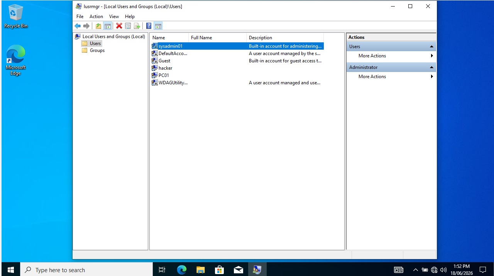
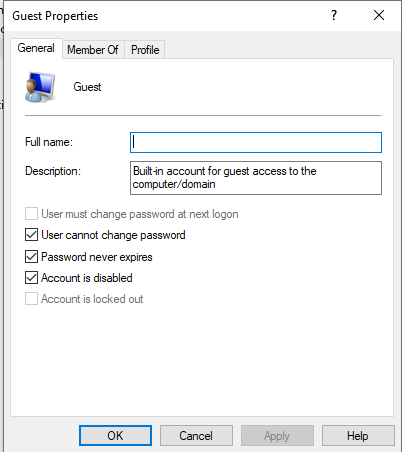
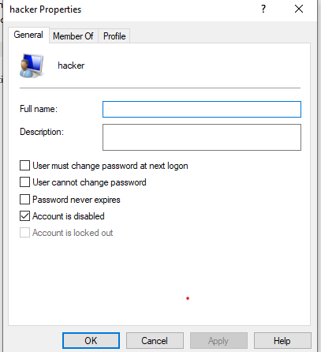
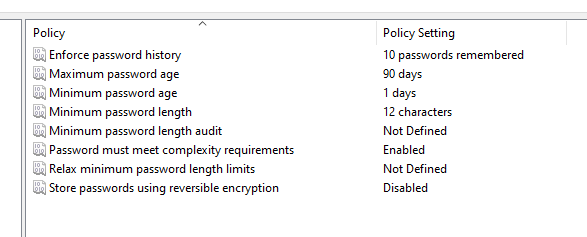
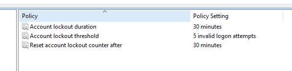
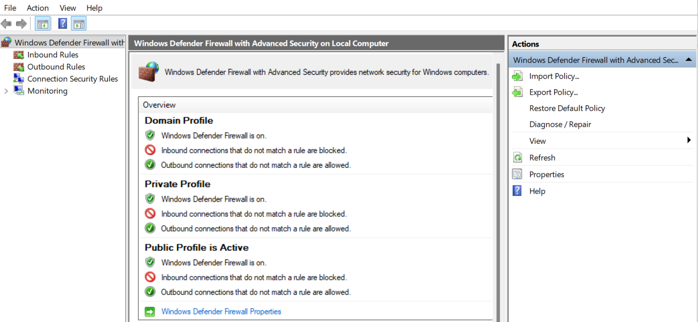
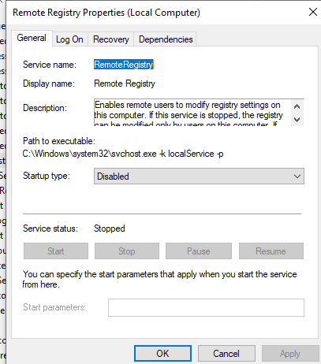
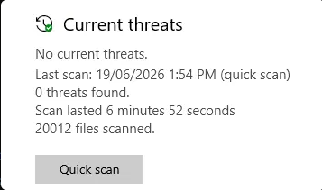
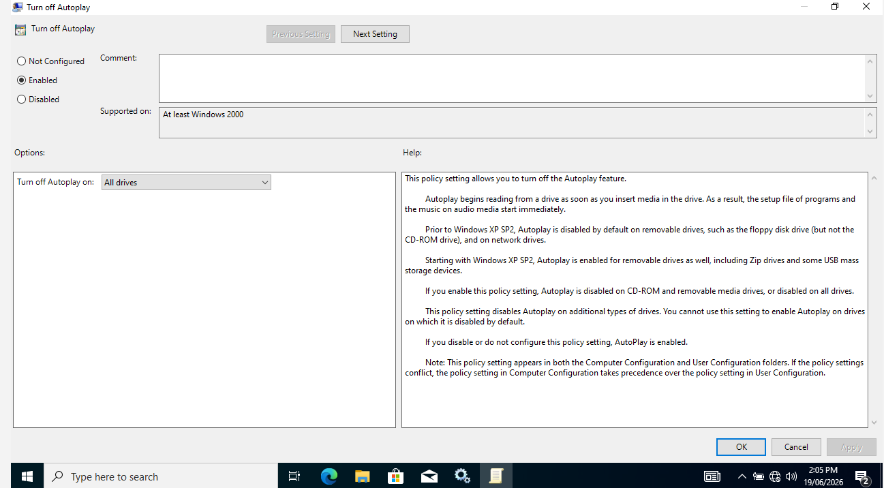
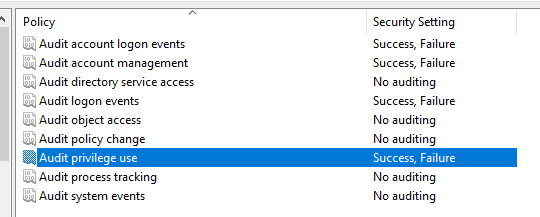

# Windows 10 Endpoint Hardening Guide

A step-by-step hardening guide for Windows 10 endpoints based on security best practices. This guide covers account policies, firewall configuration, service hardening, audit logging, and more — implemented in a domain-joined environment managed by Windows Server 2022 Active Directory.

---

## Environment

| Component | Details |
|---|---|
| Target Machine | Windows 10 Pro (PC01) |
| Domain Controller | Windows Server 2022 (DC01) |
| Domain | lab.local |
| Policy Management | Group Policy Management Console (GPMC) |

---

## Hardening Steps

### Step 1 — Rename Default Administrator Account
**Why:** Attackers always try to brute force accounts named "Administrator" first. Renaming it removes a known attack vector.

**What was done:** Renamed the built-in Administrator account to `sysadmin01` using `lusrmgr.msc`.

---

### Step 2 — Verify Guest Account is Disabled
**Why:** The Guest account allows unauthenticated access to the system. It should always be disabled.

**What was done:** Verified the Guest account was disabled in `lusrmgr.msc`.

---

### Step 3 — Disable Unauthorized User Accounts
**Why:** Any account that is not actively used or was created without authorization must be disabled immediately to prevent unauthorized access.

**What was done:** Disabled the "hacker" backdoor account that was created during attack simulation (MITRE ATT&CK T1136). This step demonstrates real-world incident remediation.

---

### Step 4 — Configure Password Policy via Group Policy
**Why:** Weak passwords are one of the most common attack vectors. Enforcing strong password requirements significantly reduces the risk of brute force and credential attacks.

**What was done:** Configured the Default Domain Policy via GPMC on DC01 with the following settings:
- Minimum password length: 12 characters
- Password complexity: Enabled
- Maximum password age: 90 days
- Password history: 10 passwords remembered

---

### Step 5 — Configure Account Lockout Policy
**Why:** Without a lockout policy, attackers can attempt unlimited password guesses. This directly counters brute force attacks (MITRE ATT&CK T1110).

**What was done:** Configured account lockout via GPMC with the following settings:
- Lockout threshold: 5 invalid attempts
- Lockout duration: 30 minutes
- Reset counter after: 30 minutes

---

### Step 6 — Verify Windows Firewall is Enabled
**Why:** Windows Firewall blocks unauthorized inbound connections. All three network profiles must be active.

**What was done:** Verified Windows Defender Firewall was enabled across all three profiles — Domain, Private, and Public — using `wf.msc`.

---

### Step 7 — Disable Unnecessary Services
**Why:** Unnecessary services running in the background increase the attack surface. Disabling them reduces potential entry points for attackers.

**What was done:** Verified Remote Registry was disabled. Confirmed Telnet was not installed. Disabled all Xbox Live services (Xbox Accessory Management, Xbox Live Auth Manager, Xbox Live Game Save, Xbox Live Networking Service) as they are not required in a work environment.

---

### Step 8 — Verify Windows Defender is Active
**Why:** Windows Defender provides real-time antivirus and threat protection. It must be active and up to date on all endpoints.

**What was done:** Ran a Quick Scan using Windows Security. Scan completed with 0 threats found across 20,012 files scanned.

---

### Step 9 — Disable USB Autorun
**Why:** USB autorun automatically executes programs when a USB drive is inserted, making it a common malware delivery vector. Disabling it prevents malicious USB-based attacks.

**What was done:** Disabled Autoplay for all drives via `gpedit.msc` under Computer Configuration → Administrative Templates → Windows Components → AutoPlay Policies.

---

### Step 10 — Enable Audit Logging
**Why:** Audit logging records security events such as logon attempts, account changes, and privilege use. This ensures all suspicious activity is captured and available for investigation — the same event IDs (4625, 4720, 4732) used in the SOC Home Lab project.

**What was done:** Enabled Success and Failure auditing for the following policies via `gpedit.msc`:
- Audit account logon events
- Audit account management
- Audit logon events
- Audit privilege use

---

## Summary of Hardening Actions

| Step | Action | Tool Used |
|---|---|---|
| 1 | Renamed Administrator account | lusrmgr.msc |
| 2 | Verified Guest account disabled | lusrmgr.msc |
| 3 | Disabled unauthorized hacker account | lusrmgr.msc |
| 4 | Configured strong password policy | GPMC (Group Policy) |
| 5 | Configured account lockout policy | GPMC (Group Policy) |
| 6 | Verified Windows Firewall on all profiles | wf.msc |
| 7 | Disabled unnecessary services | services.msc |
| 8 | Verified Windows Defender and ran scan | Windows Security |
| 9 | Disabled USB Autorun on all drives | gpedit.msc |
| 10 | Enabled audit logging for key security events | gpedit.msc |

---

## Key Takeaways

- Understood how domain-joined environments manage security policies centrally via Group Policy rather than local settings
- Applied the principle of least privilege by disabling unnecessary accounts and services
- Connected endpoint hardening concepts to real attack techniques from the MITRE ATT&CK framework
- Demonstrated incident remediation by disabling a backdoor account created during a simulated attack
